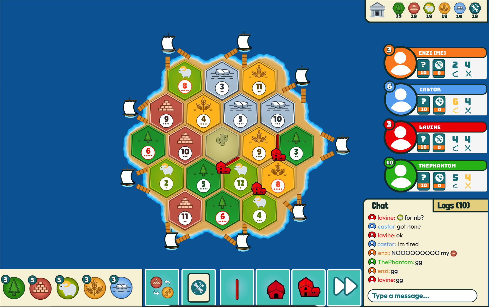

<h1 align="center">
Settlea.org
</h1>

 Settlers of Catan Free Open Source Alternative 

<b> Written in Typescript, Go & Python (discord client)</b>

<h3> Mock Design </h3>

# Join Our Discord
https://discord.gg/37RxHpKSsH

there's literally no one in yet💀
</a>
